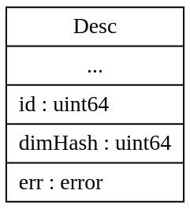

<!-- _class: lead -->


# Make a Prometheus Exporter

方浩镭

---

# 目录

- metric
- client
  - desc & metric
  - collector
  - registry
  - promhandler
- exporter
  - arch
  - example


---

## 什么是 Prometheus Metric？

- Prometheus Metric 是一种用于监控系统和应用程序的标准格式
- 它是 Prometheus 监控系统使用的数据模型，用于描述时间序列数据以及关于这些数据的元数据信息
- 这些元数据信息包括指标名称、标签和采样值等

---

## 指标名称

- 指标名称用于标识被监控对象的状态信息
- 每个指标都有一个唯一的名称，例如 `cpu_usage`
- 指标名称通常由字母、数字和下划线组成

---

## 标签

- 标签是用于描述指标的附加信息
- 它可以帮助用户更好地区分不同指标之间的差异
- 标签通常由键值对组成，例如 `instance="localhost:9090"`

---

## 采样值

- 采样值是指标的实际值
- 它是一个浮点数，反映了被监控对象的当前状态
- 采样值通常会随着时间的推移而发生变化

---

## 举例说明

以下是一个简单的 Prometheus Metric 示例：

```text
http_requests_total{method="POST", handler="/api/users"}
```

- `http_requests_total` 是指标名称；
- `method="POST", handler="/api/users"` 是标签；
- Metric 的采样值是每秒钟调用 `/api/users` 接口的次数

---

## 举例说明

观测值通常是一个标量，增加http_requests_total描述信息之后实质是一个矢量，而具有类似属性的矢量集合就构成了矩阵

$$
\begin{array}{c|llll}
{}&{fqName}&{method}&{handler}&{time}&{val}\\
\hline
{m1}&{http\_requests\_total}&{POST}&{/api/user}&{1}&{t1}\\
{m2}&{http\_requests\_total}&{POST}&{/api/user}&{2}&{t2}\\
{m2}&{http\_requests\_total}&{GET}&{/api/books}&{3}&{t1}\\
\end{array}
$$

---

## Prometheus Metric 类型
- Counter
- Gauge
- Histogram
- Summary

---

## Counter

- Counter 是一种累加器，用于记录单调递增的数据
- 它通常用来统计请求次数、任务完成数量等指标
- Counter 的取值只能增加，不能减少或重置

    

---

## Gauge

- Gauge 用于记录可变的值
- 它可以随着时间的推移而增加、减少或保持不变
- Gauge 可以用于记录 CPU 使用率、内存使用量等指标

  

---

## Histogram

- Histogram 用于记录数据的分布情况
- 它会将数据划分为多个桶(bucket)，并记录每个桶中的数据数量和总和
- Histogram 可以用于记录请求响应时间、接口访问频率等指标

  

---

## Summary

- 类似于 Histogram，Summary 也用于记录数据的分布情况
- 不同之处在于，Summary 会记录分位数，例如 50% 分位数、95% 分位数等
- Summary 通常用来记录长尾分布的数据，比如响应时间、锁等待时间等指标

---

## Histogram vs Summary 

Histogram 和 Summary 功能类似，但在分位数生成的方式上存在不同

|            |        Histogram         |         Summary          |
| :--------: | :----------------------: | :----------------------: |
|  计算方式  |          PromQL          |        采集时计算        |
| client性能 |     高，只需进行计数     | 低，需要占用资源进行计算 |
| server性能 | 低，需要占用资源进行计算 |    高，本质是指标查询    |
|  聚合能力  |    可以与同类指标聚合    |      无法进一步聚合      |

---

## Prometheus Client
- Desc & Metric
- Collector
- Registry
- PromHandler
--- 


---
## Prometheus Client

Prometheus Client 是进行 Exporter 开发的基础库，其中包含了
- 基本的数据接口定义, Desc 与 Metric
- 采集器的抽象 Collector
- 采集器的管理抽象 Registry
- 通用采集的入口定义 PromHandler

---

## Desc

Desc 是 Metric 的唯一标识符，可看作是Metric的不可变元数据，包含了Metric的名称、帮助文本、标签以及类型等信息

Desc 只是 Metric 的元数据，并不包含任何数据点，但是提供了 Metric 的基本信息和结构定义，为采集器和监控系统提供了统一的接口和语义

$$
\begin{array}{c|llll}
{Desc}&{fqName}&{method}&{handler}\\
\hline

\end{array}
$$

---

## NewDesc

使用 `NewDesc` 方法能够创建一个 Desc: 
- fqName：完整的指标名称, 通过 `BuildFQName` 构造
- help：指标的帮助信息
- variableLabels：可变标签的名称
- constLabels：常量标签

```go
func NewDesc(fqName, help string, variableLabels []string, constLabels Labels) *Desc
```

---

## Desc struct

最终得到的 Desc 还会生成3个重要字段:
- **id**: 唯一标识, 与fqName和constLabels Name有关
- **dimHash**: Desc Label 组成的结构信息
- **err**: 构建时产生的错误信息



---

## Metric

Metric 是一个接口, 用于提供指标的基本数据:
- **Desc**: 返回 Metric 标识符
- **Write**: 填充相应字段到 dto.Metric 中

dto.Metric 最终编码为采集结果中的每条指标


$$
\begin{bmatrix}
{http\_requests\_total}&{POST}&{/api/user}&{1}&{t1}\\
{http\_requests\_total}&{POST}&{/api/user}&{2}&{t2}\\
{http\_requests\_total}&{GET}&{/api/books}&{3}&{t1}\\
\end{bmatrix}
$$

---

## MustNewConstMetric

使用 MustNewConstMetric 方法可以创建一个Metric
- desc：Metric 描述符
- valueType：类型，如Counter, Guage等
- value：观测值
- labelValues： 可变标签的值，对应Desc中的 variableLabels

```go
MustNewConstMetric(desc *Desc, valueType ValueType, value float64, labelValues ...string) Metric
```

---

## Collector

Collector 是一个接口，用于描述如何采集指标数据，并将进行暴露：
- Describe：将指标描述符写入管道中
- Collect：将指标数据写入到管道中


---

## Basic Collector

Client 提供了四种基本Collector，包含如下特征:
- 对外提供接口方法，封装私有变量的方式来限制对观测值的操作
- Counter与Guage记录单一的观测值，而 Histogram 和 Summary 则进行进一步统计，是一种复合指标

`Counter` `Guage`  `Histogram` `Summary`

---

## Collector struct

Collector 中包含如下部分, 以Gauge为例:
- valBits: 观测值, 是一个私有变量
- desc：描述符
- selfCollector: 匿名结构体

selfCollector 提供了 Collector 的通用实现, 而 gauge 本身只是实现了 Metric 接口, 通过内嵌结构体继承了 Collector 的实现


---

## Collector Method

| Counter      | Guage        | Histogram        | Summary          |
| ------------ | ------------ | ---------------- | ---------------- |
| Add(float64) | Add(float64) | Observe(float64) | Observe(float64) |
| Inc()        | Sub(float64) |                  |                  |
|              | Inc()        |                  |                  |
|              | Dec()        |                  |                  |
|              | Set(float64) |                  |                  |

---

## Thread Safety

Counter 和 Guage对观测值的操作都是线程安全的，内部通过调用 atomic 库来保证并发访问的安全性

```go
func (g *gauge) Add(val float64) {
	for {
		oldBits := atomic.LoadUint64(&g.valBits)
		newBits := math.Float64bits(math.Float64frombits(oldBits) + val)
		if atomic.CompareAndSwapUint64(&g.valBits, oldBits, newBits) {
			return
		}
	}
}
```

---

## Historgram Detial

Histogram需要配置有多个buckets，而每个 bucket 都类似与一个Counter, 每当有观测值落入 bucket 中时，就增加对应的值

名为`base_name`的指标有三个衍生指标:
- `base_name_bucket{le="<upper inclusive bound>"}`: 保存小于或等于bucket上界的计数
- `base_name_totoal_count`: 保存Observe的次数，即`base_name_bucket{le="inf"}`
- `base_name_totoal_sum`: 保存所有观测到的值之和

---

## Summary Detial

Summay与Histogram类似，同样是一个复合指标，存在三个衍生指标:
- `base_name{quantile="0.5"}`: 保存Summary采样周期内，50分位观测值
- `base_name_totoal_count`: 保存Observe的次数
- `base_name_totoal_sum`: 保存所有观测到的值之和

---

## Summary Detial

与Histogram不同的是，Summary中并没有buckets, 计算quantile发生在观测时
- Summary默认会在内存中创建 5 个 stream, 组成一个循环队列
- 观测值会送往每个 stream，而当超过时限时，就会清空 head 并移动
- 稳定时，head stream 保存了最久的观测值数据
- 采集指标时，首先对 head 中观测数据进行排序，然后利用线性插值法计算quantile数据

---

## Vector Collector

Vector Collector 维护了一组 Metric 映射
- Vector Metric 共享相同的 Desc, 通过不同的 VariableLabel Values 进行索引
- 可使用 `WithLabelValues` 来动态地插入一个新的或返回一个已存在的Metric

$$
\begin{array}{c|llll}
{Vector}\\
\hline
{m1}&{http\_requests\_total}&{POST}&{/api/user}&{1}\\
{m2}&{http\_requests\_total}&{POST}&{/api/login}&{2}\\
{m2}&{http\_requests\_total}&{GET}&{/api/books}&{3}\\
\end{array}
$$

---

## Registry

Registry 是 Registerer 接口的一个实现，负责注册并保存 Collector, 然后再收集 metrics 进行暴露

Registry 中使用 CollectorID 作为 Collector 的唯一标识， 通过对 Collector 中不重复的 DescID 进行异或运算得到

---

## Registry Struct

Registry中包含三个主要映射：
- collectorsByID: 保存 CollectID 到 Collector 的映射
- descIDs：保存所有 DescID 的集合
- dimHashesByName：保存 fqName 到 dimHash 的映射


---

## Register

Register 方法能够将 Collector 注册到 metric family 中
- 调用 `Describe` 方法获取 Desc 来验证 Collector
- 如 `Describe` 中返回空值，则会跳过对 Collector 的验证，开发者需要保证Collector的合法性，否则会出现抓取错误

```go
func (r *Registry) Register(c Collector) error
```

---

## Register Check

1. 集中处理 Desc 构建时的错误
2. 判断 Desc 是否与之前注册的 Co llector 的 Desc 重复
3. 收集 Collector 中非重复的 Desc, 将ID异或得到 CollectorID
4. 判断相同 fqName 的 Desc 中对应的 dimHash是否相同


---

## Gather

- **采集**:
  - 调用所有已注册 Collector 的 Collect 方法，并将收集到的指标聚合成一个**字典序且无重复**的MetricFamily protobuf切片

- **容错**:
  - 尽可能地收集指标，即便有些 Collect 返回的是**空值**

- **并发**:
  - 内部会进行一定的并发，尽可能用**最少**的协程来满足采集需求

---

## 并发控制

1. 计算当前所有的 Collector 数量，设置为可开启的协程软上限
2. 启动Worker协程，不断地从管道中取出 Collector 进行采集
3. 不断地从 Metric 管道中取出数据进行处理，而当没有数据时，根据当前状态判断是否增加 Worker


---

## PromHandler

PromHandler是一个简单的Http Handler, 主要逻辑为:
- 调用 Registry 的 Gather 方法，收集所有 Collector 的指标
- 构造 Metric 编码器，传入 Response Writer
- 调用编码器逐个对 Metric 进行处理并写入 Response 中


---

## Simple Exporter

- 编写 SimpleCollector 实现 Collector 接口
- 注册 SimpleCollector 到 Registry中
- 创建 server, 并添加 promHandler

---

<!-- _class: lead -->

?&#

