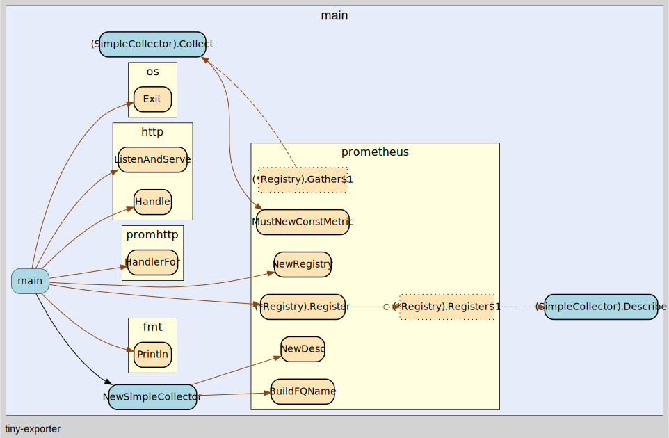

# Exporter

- [Exporter](#exporter)
  - [Simple Exporter](#simple-exporter)
  - [基本范式](#基本范式)


## Simple Exporter

```go
// collector.go
type SimpleCollector{}

var simpleDesc =  prometheus.NewDesc(
			prometheus.BuildFQName("demo", "foo", "bar"),
			"Simple collector",
			[]string{"lable_foo"}, nil,
		)

func (s SimpleCollector) Describe(ch chan<- *prometheus.Desc) {
	ch <- simpleDesc
}

func (s SimpleCollector) Collect(ch chan<- prometheus.Metric) {
	ch <- prometheus.MustNewConstMetric(
		simpleDesc,
		prometheus.CounterValue,
		1,
		"value_foo",
	)
}

// main.go
func main() {
	// 创建 prometheus registry，用来注册 Collector
	rg := prometheus.NewRegistry()
	rg.MustRegister(SimpleCollector{})

	// 创建 promHandler, 用来处理 metrics 请求
	promHandler := promhttp.HandlerFor(
	rg,
	promhttp.HandlerOpts{
		ErrorLog:            logger,
		MaxRequestsInFlight: maxRequests,
	},

	http.Handle("/metrics", promHandler)
	server := &http.Server{Addr: ":9900"}

	if err := server.ListenAndServe(); err != nil {
		os.Exit(1)
	}
)
}
```



## 基本范式

1. 编写Collector实现 `prometheus.Collector` 接口
2. 使用 `promethues.MustRegister()` 方法将Collector注册到prometheus registry中
3. 创建 server, 并添加 `promhttp.Handler()` 方法
4. 每次请求会在 `promHandler` 中进行处理，简单而言，handler 中会首先创建几个管道，用来保存一些metric/desc数据，然后调用registry中所有Collector的`Describe`,`Collect` 方法来获取指标相关的信息，并最后将其序列化返回

使用`promhttp.Handler`作为采集入口时，会额外地采集请求处理过程中的性能数据，如果要关闭这些数据，可以使用`promhttp.HandlerFor`作为替换oo

```go
rg := prometheus.NewRegistry()
rg.MustRegister(serverCollector)

http.Handle(metricsPath, promhttp.HandlerFor(rg, promhttp.HandlerOpts{ErrorLog: logger}))
```
